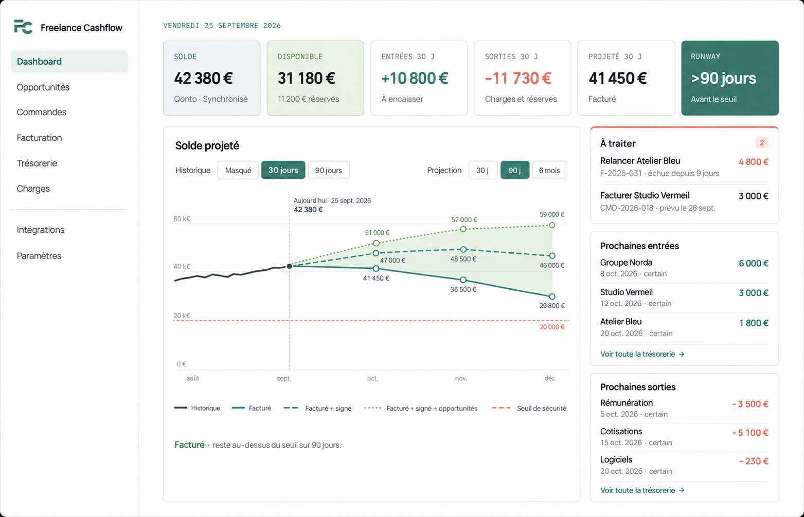

# Freelance Cashflow

Freelance Cashflow relie le pipeline commercial, la facturation, les paiements, les charges et la prévision de trésorerie d’un freelance. L’application est conçue pour une installation self-hosted appartenant à un seul propriétaire fonctionnel.



## Périmètre actuel

Le Jalon 1 couvre le parcours manuel complet :

`Client → Opportunité → Commande → Échéancier → Facture → Paiement → Prévision → Dashboard`

Il comprend aussi l’import de factures CSV, les charges récurrentes et ponctuelles, les réserves, les horizons 30/90/180 jours et les scénarios certain/engagé/probable. Toutes les données affichées par le dashboard proviennent de PostgreSQL et du moteur de prévision déterministe.

La connexion Qonto en lecture seule, sa synchronisation atomique et ses vues bancaires sont implémentées et testées avec HTTP fictif et PostgreSQL réel. La validation du compte réel reste à effectuer. Tiime dispose de contrats internes et d’un écran de préparation ; son connecteur attend l’accès API officiel. Le Jalon 2 complet reste donc en attente des validations réelles. Voir [Qonto](docs/QONTO.md) et [Tiime](docs/TIIME.md). Les parcours manuels/CSV restent disponibles.

## Jalon 3 : installation et durcissement

Le parcours **Paramètres → Installation et diagnostic** guide la configuration
et vérifie le contrat de base. Après application des migrations du jalon 3,
Qonto s'actualise si sa dernière publication date de plus de cinq minutes,
uniquement pendant l'utilisation de l'application. Aucun worker Scaleway ni cron
n'est requis. Next.js reste local avec Supabase hébergé.

Les deux nouvelles migrations restent à appliquer séparément sur la base
hébergée : voir [mise à jour](docs/UPDATES.md). Guides disponibles :
[sauvegarde/restauration](docs/BACKUP_RESTORE.md),
[déploiement web facultatif](docs/DEPLOYMENT.md),
[contribution](CONTRIBUTING.md) et [sécurité](SECURITY.md).

## Architecture

Le repository est un monorepo pnpm :

- `apps/web` : application Next.js, authentification, écrans métier et dashboard ;
- `packages/domain` : règles financières et moteur de prévision sans dépendance à Next.js ou Supabase ;
- `packages/integrations` : normalisation CSV, adaptateur Qonto serveur et contrats Tiime ;
- `packages/shared` : montants en centimes, dates locales et primitives partagées ;
- `supabase` : migrations PostgreSQL, RLS, fonctions métier, seed et tests pgTAP.

Supabase PostgreSQL est la source de vérité. Une installation correspond à un propriétaire, et les tables financières sont isolées par `owner_user_id` et Row Level Security.

## Démarrage

L’installation choisie utilise **Next.js local avec Supabase hébergé**. Node.js 24 et pnpm 10 via Corepack suffisent au fonctionnement ; Docker est réservé aux tests isolés et à l’alternative de développement locale.

```bash
corepack enable
corepack pnpm install --frozen-lockfile
corepack pnpm dev
```

Le propriétaire configure auparavant les variables Supabase et Qonto dans le fichier ignoré `apps/web/.env.local`. Le guide [INSTALLATION.md](docs/INSTALLATION.md) distingue cette installation de la stack Docker de test. Les migrations `202609110001_recurring_detection.sql` et `202609110002_recurring_detection_functions.sql` sont déjà appliquées. Les migrations `202609120001_history_recurring_decisions.sql` et `202609120002_automatic_qonto_admission.sql` ont été explicitement autorisées et appliquées le 14 septembre 2026 sur le projet hébergé ; aucun reset n’est autorisé sur celui-ci.

Les charges mensuelles détectées apparaissent dans **Charges** après analyse. Elles restent sans effet financier avant confirmation ou association ; les corrections sont conservées et les mois déjà payés sont exclus de la projection. Voir [Détection des récurrences](docs/RECURRING_DETECTION.md).

## Vérifications

```bash
corepack pnpm lint
corepack pnpm typecheck
corepack pnpm test:run
corepack pnpm build
corepack pnpm test:isolated
corepack pnpm test:client-boundary
```

Les tests isolés dérivent une stack jetable `jalon-2-qonto-tests` (ports 563xx) et lancent Chromium sur 3200. Ils refusent toute autre stack, gardent les identifiants en mémoire et remplacent les variables Qonto par des canaris fictifs sous interception HTTP. Les parcours manuel, Qonto et récurrences créent chacun leur propriétaire fictif puis le suppriment. Voir les sous-commandes dans [QONTO.md](docs/QONTO.md).

## Licence

Le code du projet est distribué sous la licence [GNU AGPL-3.0](LICENSE). Les noms et logos des services tiers restent la propriété de leurs titulaires.

Les données et calculs présentés ne constituent ni une comptabilité complète ni un conseil fiscal, social ou financier.

### Autres connexions directes

Pennylane, Revolut Business et bunq disposent désormais de connecteurs serveur en lecture seule, sans agrégateur. Leur activation nécessite la migration `202609180001_direct_integrations.sql` et les identifiants du titulaire. Consultez [Connexions directes](docs/DIRECT_INTEGRATIONS.md) ou **Intégrations → Configurer** pour les offres requises et les limites. La validation sur compte réel reste à effectuer.
