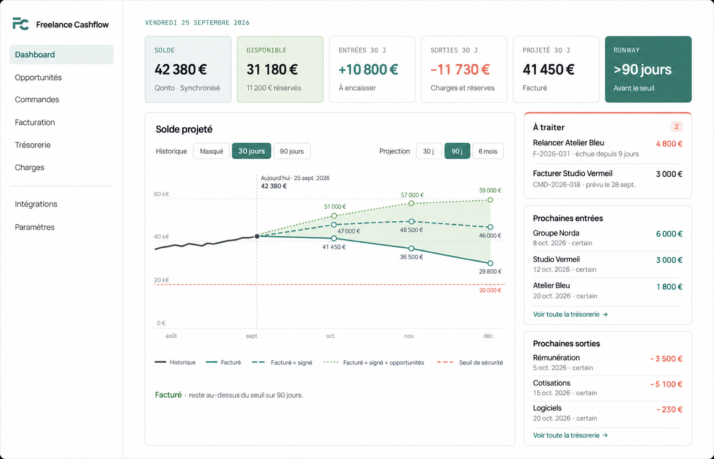

# Freelance Cashflow

**Anticipez l’argent disponible sur votre compte dans les prochaines semaines et les prochains mois.**

Freelance Cashflow aide les indépendants à suivre leurs clients, leurs factures, leurs encaissements et leurs dépenses au même endroit. Vous pouvez comparer plusieurs prévisions, selon les revenus déjà confirmés et les missions encore en discussion.

## Installer et commencer

L’application s’utilise dans votre navigateur. Dans l’installation décrite ici, elle fonctionne sur **votre ordinateur**, tandis que vos données sont conservées dans **votre propre espace Supabase**, un service de base de données en ligne. Une installation est prévue pour une seule personne.

Choisissez la méthode adaptée à votre ordinateur :

| Votre ordinateur | Installation |
| --- | --- |
| **Mac Apple Silicon (M1, M2, M3, M4 ou ultérieur), macOS 13 minimum** | [Télécharger l’installateur Mac 0.1.5](https://github.com/charleslerminiaux-caameleon/freelance-cashflow/releases/download/desktop-v0.1.5/Freelance.Cashflow-0.1.5-mac-arm64.dmg) |
| **PC Windows** | Suivez la [procédure manuelle ci-dessous](#installation-manuelle--windows-et-autres-systèmes), en attendant l’arrivée de l’installateur Windows. |
| **Mac Intel ou Linux** | Utilisez la procédure manuelle. Le fichier Mac proposé ne prend pas en charge les Mac Intel. |

### Installer sur Mac Apple Silicon

1. Téléchargez le fichier **Freelance.Cashflow-0.1.5-mac-arm64.dmg** depuis le lien ci-dessus ou la [page de téléchargement GitHub](https://github.com/charleslerminiaux-caameleon/freelance-cashflow/releases/tag/desktop-v0.1.5).
2. Ouvrez le fichier `.dmg`, puis glissez **Freelance Cashflow** dans **Applications**.
3. Ouvrez Freelance Cashflow depuis Applications. Cette **préversion n’est pas encore signée ni notariée par Apple**. Si macOS bloque l’ouverture parce que le développeur ne peut pas être vérifié, ouvrez **Réglages Système → Confidentialité et sécurité → Ouvrir quand même**, puis confirmez, uniquement si le fichier provient bien de cette page GitHub. Voir l’[aide officielle Apple](https://support.apple.com/fr-fr/102445).
4. Suivez l’assistant pour créer ou relier votre propre projet Supabase. Il explique les clés à fournir, les permissions et la durée du jeton temporaire, puis prépare la base après votre confirmation.
5. Freelance Cashflow s’ouvre dans votre navigateur. Les fois suivantes, double-cliquez simplement sur l’application.

Vous n’avez pas besoin d’installer Node.js, Git, pnpm ou Docker avec cet installateur. Un compte Supabase et une connexion Internet restent nécessaires. Le [guide Mac détaillé](docs/DESKTOP_INSTALLATION.md) explique la configuration et les mises à jour. Pour remplacer une version précédente, quittez d’abord Freelance Cashflow, puis remplacez l’application dans Applications ; vos réglages sont conservés.

### Être informé des mises à jour

À partir de la version 0.1.5, l’application affiche un avertissement lorsqu’une nouvelle version de sa distribution est disponible, sans compte GitHub. Consultez les nouveautés, puis choisissez de télécharger la mise à jour, de la reporter ou d’ignorer cette version. Rien n’est installé automatiquement.

Dans **Paramètres → Mises à jour**, retrouvez la version installée et sa provenance, désactivez les vérifications ou réaffichez une version ignorée. Un fork communautaire suit ses propres publications ; changer de distribution demande de vérifier ses instructions et la compatibilité des données. Voir le [fonctionnement des mises à jour](docs/APPLICATION_UPDATES.md).

Si vous utilisez encore la version 0.1.4, téléchargez et installez manuellement la 0.1.5 une première fois pour bénéficier de ces avertissements.

## Installation manuelle — Windows et autres systèmes

**Sur PC Windows, utilisez cette procédure en attendant l’installateur Windows.** Elle reste aussi disponible sur Mac et Linux. Quelques commandes sont nécessaires la première fois ; ensuite, la gestion quotidienne se fait dans l’interface.

### 1. Préparer les outils

Les étapes ci-dessous sont à faire une seule fois. Docker n’est pas nécessaire et les banques peuvent être connectées plus tard.

#### Ouvrir le terminal

Le terminal est une fenêtre dans laquelle vous collez des commandes, puis appuyez sur **Entrée** pour les lancer.

- **Sur Mac** : appuyez sur **⌘ + Espace**, tapez `Terminal`, puis appuyez sur Entrée.
- **Sur Windows** : ouvrez le menu Démarrer, tapez `cmd`, puis ouvrez **Invite de commandes**.
- **Sur Linux** : ouvrez l’application **Terminal** de votre distribution.

**Ne collez pas toutes les étapes d’un coup.** Copiez une commande à la fois et attendez qu’elle se termine. **Si elle affiche une erreur, arrêtez-vous à cette étape** : les suivantes ne pourront pas réparer la précédente. Les lignes ci-dessous ne sont pas à saisir dans la barre d’adresse du navigateur.

#### Installer Node.js

Node.js permet à Freelance Cashflow de fonctionner sur votre ordinateur.

1. Ouvrez la [page officielle de téléchargement de Node.js](https://nodejs.org/en/download).
2. Sélectionnez la **version 24 LTS** et votre système (**macOS**, **Windows** ou **Linux**).
3. Sur Mac ou Windows, téléchargez l’installateur **`.pkg`** ou **`.msi`**, ouvrez-le et suivez les étapes. Sur Linux, suivez les commandes proposées sur cette page pour votre système.
4. Fermez puis rouvrez votre terminal, et lancez :

```bash
node --version
npm --version
```

La première commande doit afficher `v24.` suivi d’autres chiffres. La seconde affiche un numéro de version : **npm est installé avec Node.js**, vous n’avez pas à l’installer séparément.

#### Installer Git

Git sert ici à télécharger l’application.

- **Sur Windows** : téléchargez l’installateur depuis la [page officielle Git pour Windows](https://git-scm.com/install/windows), ouvrez-le et conservez les choix proposés par défaut.
- **Sur Mac** : la [documentation Git pour macOS](https://git-scm.com/install/mac) propose les outils Apple. Lancez cette commande, puis acceptez l’installation dans la fenêtre qui s’ouvre :

```bash
xcode-select --install
```

Cette commande est réservée au Mac. **Attendez la fin de l’installation dans la fenêtre Apple avant de continuer**, même si le terminal vous permet déjà de saisir une autre commande. Si un message indique que les outils sont déjà installés, passez à la vérification ci-dessous.

- **Sur Linux** : suivez la [procédure Git pour votre distribution](https://git-scm.com/install/linux).

Après l’installation, fermez puis rouvrez le terminal et vérifiez :

```bash
git --version
```

Vous devez obtenir `git version` suivi d’un numéro. Si `node`, `npm` ou `git` est « introuvable » ou « non reconnu », vérifiez que l’installation correspondante est terminée, puis rouvrez le terminal avant de continuer.

#### Créer votre espace Supabase

Supabase conserve les données de l’application. **Rien à installer sur votre ordinateur pour cette étape** : tout se passe sur son site.

1. Ouvrez [Supabase](https://supabase.com/dashboard) et créez un compte, ou connectez-vous si vous en avez déjà un.
2. Créez une organisation si le site le demande : c’est simplement l’espace qui regroupe vos projets. Vous pouvez lui donner votre nom.
3. Cliquez sur **New project** (« Nouveau projet ») et nommez-le `freelance-cashflow`.
4. Choisissez un mot de passe pour la base de données, conservez-le dans votre gestionnaire de mots de passe, puis choisissez une région proche de vous.
5. Validez la création et attendez que le projet soit prêt. Gardez cette page ouverte : vous y récupérerez les valeurs demandées à l’étape 3.

Le mot de passe de la base est distinct de celui de votre compte Supabase. Il pourra vous être demandé lors de la connexion du projet depuis le terminal.

### 2. Télécharger l’application

Téléchargez d’abord le projet. Attendez la fin du téléchargement avant de continuer :

```bash
git clone https://github.com/charleslerminiaux-caameleon/freelance-cashflow.git
```

Si le terminal affiche `No developer tools were found`, terminez l’installation des outils Apple décrite plus haut, vérifiez `git --version`, puis relancez le téléchargement. Si le dossier existe déjà, ne le supprimez pas : vérifiez qu’il contient le projet avant de reprendre.

Entrez ensuite dans le dossier téléchargé :

```bash
cd freelance-cashflow
```

**Si cette commande affiche `no such file or directory`, arrêtez-vous : le projet n’a pas été téléchargé à cet emplacement.** Ne lancez pas encore l’installation des composants.

Vérifiez que vous êtes dans le bon dossier :

```bash
node -e "console.log(require('./package.json').name); console.log('Fichier de versions présent :', require('node:fs').existsSync('pnpm-lock.yaml'))"
```

Vous devez lire **`freelance-cashflow`** et **`Fichier de versions présent : true`**. Installez alors les composants :

```bash
npx --yes pnpm@10.17.1 install --frozen-lockfile
```

`npx`, fourni avec Node.js et npm, lance ici la version de pnpm prévue par le projet. Cette méthode utilise le cache de votre compte utilisateur et **ne nécessite ni installation globale de Corepack, ni `corepack enable`, ni `sudo`**. Voir la [documentation officielle de npx](https://docs.npmjs.com/cli/v11/commands/npx/).

Attendez la fin de l’installation sans erreur. Gardez ce terminal ouvert et restez dans le dossier `freelance-cashflow` pour les étapes suivantes.

#### Si vous avez essayé l’ancienne procédure sur Mac

| Message affiché | Ce qu’il signifie et comment reprendre |
| --- | --- |
| `No developer tools were found` | Les outils Apple nécessaires à Git manquent. Lancez `xcode-select --install`, attendez la fin de l’installation, puis vérifiez `git --version` et recommencez le téléchargement. |
| `cd: no such file or directory: freelance-cashflow` | Le téléchargement n’a pas créé le dossier à cet emplacement. Reprenez à `git clone` après avoir vérifié Git. |
| `EACCES` avec `/usr/local/…` lors de l’installation de Corepack | L’ancienne procédure essayait d’écrire dans un dossier système. Laissez de côté `npm install --global corepack` et `corepack enable` ; utilisez la commande `npx` ci-dessus une fois dans le dossier du projet. |
| `ERR_PNPM_NO_LOCKFILE` | Le fichier `pnpm-lock.yaml` est introuvable, généralement parce que vous n’êtes pas dans le dossier du projet. Vérifiez le dossier comme indiqué plus haut. Ne retirez pas `--frozen-lockfile` pour contourner cette erreur. |

### 3. Relier votre espace Supabase

Depuis le dossier `freelance-cashflow`, créez le fichier de configuration avec cette commande, identique sur Mac, Windows et Linux. Elle est destinée à une première installation : elle copie le modèle dans **`apps/web/.env.local`**.

```bash
node -e "require('node:fs').copyFileSync('.env.example', 'apps/web/.env.local', require('node:fs').constants.COPYFILE_EXCL)"
```

Si le message contient `EEXIST`, le fichier existe déjà : conservez-le et ouvrez-le directement.

Pour l’ouvrir **sur Windows**, lancez `notepad apps\web\.env.local`. **Sur Mac**, lancez `open -e apps/web/.env.local`. Sur Linux, ouvrez ce fichier avec votre éditeur de texte ; **Ctrl+H** permet généralement d’afficher les fichiers dont le nom commence par un point.

Revenez sur votre projet dans le [tableau de bord Supabase](https://supabase.com/dashboard). Le bouton **Connect** permet de retrouver l’URL du projet ; les clés sont dans **Settings → API Keys** (« Paramètres → Clés API »). Consultez au besoin l’[aide officielle pour retrouver les clés](https://supabase.com/docs/guides/api/api-keys).

Dans le fichier, collez chaque valeur après le signe `=` de la ligne correspondante, puis enregistrez avec **Ctrl+S** sur Windows ou **⌘+S** sur Mac :

| Ligne à remplir | Valeur à copier depuis Supabase |
| --- | --- |
| `NEXT_PUBLIC_SUPABASE_URL` | L’URL du projet |
| `NEXT_PUBLIC_SUPABASE_ANON_KEY` | La clé publique `anon` |
| `SUPABASE_SERVICE_ROLE_KEY` | La clé secrète `service_role` |

Les clés `anon` et `service_role` se trouvent dans la rubrique des clés API historiques (« legacy »). Gardez ce fichier privé : la clé `service_role` donne un accès privilégié à vos données. Laissez les autres valeurs vides pour commencer sans connexion bancaire.

Préparez ensuite la base de données avec les commandes suivantes. Remplacez `REFERENCE_DU_PROJET` par l’identifiant de votre nouveau projet Supabase, disponible dans **Settings → General → Reference ID**. Vous le retrouvez aussi dans l’adresse de la page du projet : dans `https://supabase.com/dashboard/project/abcdefghijklmnopqrst`, la référence est `abcdefghijklmnopqrst`.

La commande `login` vous guide pour autoriser la connexion dans le navigateur. La commande `link` peut demander le mot de passe de la base choisi lors de sa création ; les caractères peuvent rester invisibles pendant la saisie, c’est normal.

```text
Exemple à adapter :
npx --yes pnpm@10.17.1 dlx supabase@2.116.0 link --project-ref abcdefghijklmnopqrst
```

Voici les commandes à lancer dans l’ordre :

```bash
npx --yes pnpm@10.17.1 dlx supabase@2.116.0 login
npx --yes pnpm@10.17.1 dlx supabase@2.116.0 link --project-ref REFERENCE_DU_PROJET
npx --yes pnpm@10.17.1 dlx supabase@2.116.0 db push --linked --dry-run
```

La dernière commande affiche les fichiers qui vont créer la structure de votre base. Vérifiez que le projet lié est bien le **nouveau projet vide dédié à Freelance Cashflow**, puis appliquez-les :

```bash
npx --yes pnpm@10.17.1 dlx supabase@2.116.0 db push --linked
```

Dans les paramètres d’authentification Supabase, définissez aussi l’URL du site sur `http://localhost:3000` et autorisez les inscriptions par e-mail pour créer votre premier compte.

Vous avez déjà une installation ? Suivez le [guide de mise à jour](docs/UPDATES.md) avec sauvegarde préalable plutôt que cette procédure de première installation.

### 4. Ouvrir Freelance Cashflow

**À chaque ouverture d’un nouveau terminal, revenez d’abord dans le dossier de l’application.** Le terminal ne se souvient pas nécessairement du dossier utilisé la fois précédente.

**Sur Mac ou Linux**, si vous avez téléchargé le projet dans votre dossier personnel :

```bash
cd ~/freelance-cashflow
```

**Sur Windows**, dans l’Invite de commandes :

```bat
cd /d "%USERPROFILE%\freelance-cashflow"
```

Ces chemins correspondent à un téléchargement dans votre dossier personnel. Si vous avez placé le projet ailleurs, utilisez son emplacement réel. Par exemple, sur Mac, pour un projet téléchargé sur le Bureau : `cd ~/Desktop/freelance-cashflow`.

**Si `cd` affiche une erreur, arrêtez-vous et retrouvez le dossier avant de continuer.** Une fois dans le dossier de l’application, lancez cette commande, identique sur les trois systèmes :

```bash
npx --yes pnpm@10.17.1 run dev
```

Attendez que le terminal indique que l’application est prête (« Ready »), puis ouvrez **[http://localhost:3000](http://localhost:3000)** dans votre navigateur. Si le terminal indique un autre port, ouvrez l’adresse affichée à la ligne « Local ».

Créez votre compte, confirmez votre adresse e-mail si Supabase le demande, puis connectez-vous et suivez les étapes de configuration. Le parcours **Paramètres → Installation et diagnostic** vous aide à vérifier votre installation.

Gardez le terminal ouvert pendant l’utilisation. Pour arrêter l’application, appuyez sur **Ctrl+C**. Pour la rouvrir dans un nouveau terminal, **refaites les deux étapes : `cd` vers le dossier du projet, puis la commande `npx` ci-dessus**. Vous n’avez pas besoin de télécharger à nouveau le projet ni de réinstaller ses composants.

#### Si le terminal affiche « Command "dev" not found »

Cette erreur peut apparaître lorsque la commande est lancée en dehors du dossier de l’application. Sur Mac, un **`~` juste avant `%`** indique généralement que vous êtes dans votre dossier personnel, pas dans `freelance-cashflow`.

Reprenez la commande `cd` adaptée à votre système ci-dessus, puis relancez `npx --yes pnpm@10.17.1 run dev`. Si l’erreur persiste, lancez :

```bash
npm pkg get name scripts.dev
```

Le résultat doit contenir `freelance-cashflow` et le script `pnpm --filter @fc/web dev`. Pour demander de l’aide, transmettez la commande saisie et le message d’erreur complet.

#### Si le terminal affiche « next: command not found » ou « node_modules missing »

Le projet est téléchargé, mais ses composants ne sont pas installés, ou leur installation n’est pas terminée. Le dossier `node_modules` est créé lors de cette installation ; il n’est pas inclus dans le téléchargement Git.

Depuis le dossier `freelance-cashflow`, lancez :

```bash
npx --yes pnpm@10.17.1 install --frozen-lockfile
```

**Attendez la fin sans erreur avant de continuer.** Si l’installation échoue, transmettez la commande et sa sortie complète pour obtenir de l’aide ; ne relancez pas encore l’application. Il n’est pas nécessaire d’installer `next` séparément ni globalement : il fait partie des composants du projet.

Une fois l’installation réussie, démarrez l’application :

```bash
npx --yes pnpm@10.17.1 run dev
```

### 5. Faire votre première prévision

1. Renseignez votre solde de départ.
2. Ajoutez vos clients, vos missions et les paiements attendus.
3. Ajoutez vos dépenses ponctuelles ou récurrentes.
4. Consultez le tableau de bord pour voir l’évolution prévue de votre trésorerie sur 30, 90 ou 180 jours.

Vous pouvez commencer **sans connecter de banque** : la saisie manuelle et l’import de factures CSV sont disponibles. Un CSV est un fichier de tableau ; l’écran d’import indique les colonnes attendues et permet de vérifier les données avant de les enregistrer.

## Connecter vos banques et vos outils

Les connexions sont facultatives et configurables dans **Intégrations → Configurer**. Elles nécessitent les accès fournis par chaque service et, selon le fournisseur, une offre compatible. Les connecteurs lisent les données ; ils ne déclenchent aucun paiement.

| Service | Utilisation prévue |
| --- | --- |
| **Qonto** | Importer les comptes, soldes et opérations bancaires. |
| **Revolut Business** | Importer les comptes, soldes et opérations d’un compte Business compatible. |
| **bunq** | Importer les comptes de paiement et les opérations prises en charge. |
| **Pennylane** | Importer les clients et les factures. |
| **Tiime** | Connexion en préparation, en attente d’accès à son API. |

Les connecteurs Qonto, Revolut Business, bunq et Pennylane sont implémentés ; leur validation complète sur des comptes réels reste à effectuer. Les autres banques ne sont pas toutes prises en charge : consultez les [conditions et limites des connexions](docs/DIRECT_INTEGRATIONS.md).

**Pour Tiime**, il faut demander directement à Tiime un accès et une clé API spécifiques — une autorisation permettant à deux logiciels de communiquer. Cet accès est normalement réservé aux éditeurs de solutions dans le cadre d’un partenariat, comme le précise l’[aide officielle Tiime](https://support.tiime.fr/fr/articles/26240-proposez-vous-une-api). Un travail est en cours pour résoudre cette limitation et finaliser la connexion. Elle n’est donc pas encore utilisable dans l’application. En attendant, vous pouvez saisir vos factures ou les importer par CSV en adaptant les colonnes au modèle demandé.

## Aperçu



## Informations techniques

Cette partie s’adresse aux personnes qui installent, maintiennent ou développent l’application.

### Architecture

Le projet utilise Next.js pour l’interface et le serveur, Supabase pour l’authentification et PostgreSQL pour les données. Les calculs de prévision sont regroupés dans un moteur métier indépendant de l’interface.

| Dossier | Contenu |
| --- | --- |
| `apps/web` | Interface, authentification et actions serveur Next.js |
| `packages/domain` | Règles financières et moteur de prévision |
| `packages/integrations` | Import CSV et connecteurs fournisseurs |
| `packages/shared` | Outils communs pour les montants et les dates |
| `supabase` | Migrations, règles d’accès et tests de la base |

Le dépôt utilise pnpm 10.17.1 et Node.js 24. Les commandes de ce guide lancent pnpm via `npx`, sans installation globale. Chaque installation est mono-propriétaire ; les données financières sont protégées par `owner_user_id` et les règles Row Level Security de PostgreSQL.

Les migrations du dossier `supabase/migrations` préparent une nouvelle base. Pour une base existante, vérifiez les migrations en attente et sauvegardez les données avant application. Ne lancez pas `db reset` sur votre base hébergée.

Les connexions configurées depuis l’interface nécessitent un stockage serveur privé et persistant pour leurs identifiants. Consultez le [guide des connexions directes](docs/DIRECT_INTEGRATIONS.md) avant de choisir un hébergement web.

### Documentation détaillée

- [Installation et environnement de développement](docs/INSTALLATION.md)
- [Mises à jour](docs/UPDATES.md)
- [Sauvegarde et restauration](docs/BACKUP_RESTORE.md)
- [Qonto](docs/QONTO.md), [connexions directes](docs/DIRECT_INTEGRATIONS.md) et [préparation Tiime](docs/TIIME.md)
- [Détection des dépenses récurrentes](docs/RECURRING_DETECTION.md)
- [Exploitation et déploiement web](docs/DEPLOYMENT.md)
- [Contribuer](CONTRIBUTING.md) et [sécurité](SECURITY.md)

### Vérifications pour le développement

```bash
npx --yes pnpm@10.17.1 lint
npx --yes pnpm@10.17.1 typecheck
npx --yes pnpm@10.17.1 test:run
npx --yes pnpm@10.17.1 build
npx --yes pnpm@10.17.1 test:isolated
npx --yes pnpm@10.17.1 test:client-boundary
```

Les deux dernières commandes nécessitent Docker et utilisent une base de test jetable dédiée, avec des fournisseurs simulés. Elles ne doivent pas utiliser les données ni les identifiants de votre installation réelle. Le [guide d’installation](docs/INSTALLATION.md) détaille les prérequis de test, dont Chromium.

## Licence

Le code est distribué sous licence [GNU AGPL-3.0](LICENSE). Les noms et logos des services tiers restent la propriété de leurs titulaires.

Freelance Cashflow est un outil de prévision : il ne remplace pas une comptabilité complète ni un conseil fiscal, social ou financier.
